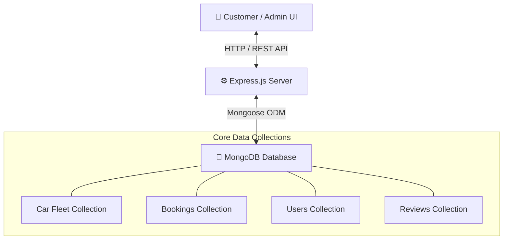

# 🚗 TORQUE — Luxury & Performance Car Rental System
### *Short Project Explanation & Technical Documentation*

---

## 📌 1. Project Overview

**TORQUE** is a state-of-the-art, full-stack web application designed for luxury, sports, and premium electric vehicle rentals. It offers a high-performance experience for both customers reserving vehicles and administrators managing fleet operations, reservations, users, and revenue analytics.

The application features **Light Mode and Dark Mode** support, real-time backend synchronization, persistent user favorites, interactive booking workflows, and an executive administration dashboard.

---

## 🛠️ 2. Technology Stack

### **Frontend Architecture**
- **Framework**: React 18 (Vite)
- **Styling**: Modern CSS System with HSL dynamic theme tokens (Dark & Light Mode glassmorphism)
- **Routing**: React Router DOM (v6) with lazy-loaded code-splitting
- **State Management**: React Context API (`AuthContext`, `ThemeContext`, `ToastContext`, `FavoritesContext`)
- **Icons**: Lucide React

### **Backend Architecture**
- **Runtime**: Node.js & Express.js REST API server
- **Database**: MongoDB with Mongoose ODM
- **Authentication**: JSON Web Tokens (JWT) with HTTP-only headers / Local Storage sync & Bcrypt password hashing
- **Data Seeding**: Automated sample booking, vehicle, and user data initialization

---

## ⭐ 3. Key Core Features

### 👤 **Customer / User Side**
1. **Showroom & Fleet Gallery**:
   - Filter vehicles by category (SUV, Sedan, Electric, Luxury, Sports), transmission, fuel type, price range, and search query.
   - Instant live search and dynamic pagination across the full vehicle catalog.
2. **Car Configuration & Details Page**:
   - High-definition vehicle gallery, performance specifications (acceleration, top speed, horsepower), and customer review section.
3. **Favorites / Heart Feature**:
   - Persistent per-user favorites system that isolates saved vehicles per account and persists across browser refreshes.
4. **4-Step Interactive Booking Workflow**:
   - **Step 1**: Schedule & Pickup/Dropoff Location Selection.
   - **Step 2**: Driver Details & License Verification.
   - **Step 3**: Payment Gateway Selection (UPI, Credit/Debit Card, Cash on Pickup).
   - **Step 4**: Booking Confirmation Voucher with PDF/Print support.
5. **Journey Timeline (Booking History)**:
   - Real-time customer reservation portal to track active trips, completed rentals, or cancel upcoming bookings.

---

### 👨‍💼 **Admin Control Center (`/admin`)**
1. **Executive Dashboard & Revenue Analytics**:
   - Real-time **Total Revenue** card with Indian currency formatting (`₹6,57,296`), monthly growth indicators (`+12.4%`), and breakdown.
   - **Booking Analytics & Status Chart**: Dynamic 3-column breakdown across lifecycle states (`Pending`, `Confirmed`, `Active`, `Completed`, `Cancelled`, `Rejected`).
2. **Fleet Management (CRUD)**:
   - Add, edit, or remove vehicles from the catalog. Toggle vehicle availability and update pricing per day.
3. **Reservations Feed & Lifecycle Manager**:
   - Complete table showing Booking ID (`#FE-529657`), Customer Details (Name, Email, Phone), Car Model, Schedule & Hub, Amount, Payment Status, and Status Action Dropdowns.
   - Page size options (`10`, `20`, `50`, `All`) and real-time status update synchronization.
4. **User & Review Moderation**:
   - Manage registered customer accounts and moderate vehicle reviews.
5. **Dynamic Left Sidebar Badges**:
   - Real-time MongoDB counts for Fleet (`36`), Bookings (`22`), Users (`16`), Payments (`20`), and Reviews (`1797`).

---

## 🔄 4. System Data Flow



---

## ⚡ 5. Project Execution Instructions

### **1. Start Backend Server**
```bash
cd server
npm install
npm start
# Server runs on http://localhost:9002
```

### **2. Start Client Application**
```bash
cd client
npm install
npm run dev
# Web App runs on http://localhost:3253
```

---

## 🔐 6. Default Admin Credentials

- **Admin Portal URL**: `http://localhost:3253/admin`
- **Email**: `admin@torque.com`
- **Password**: `admin123`
